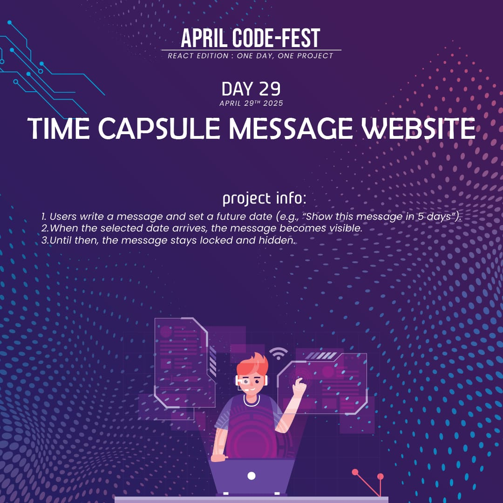
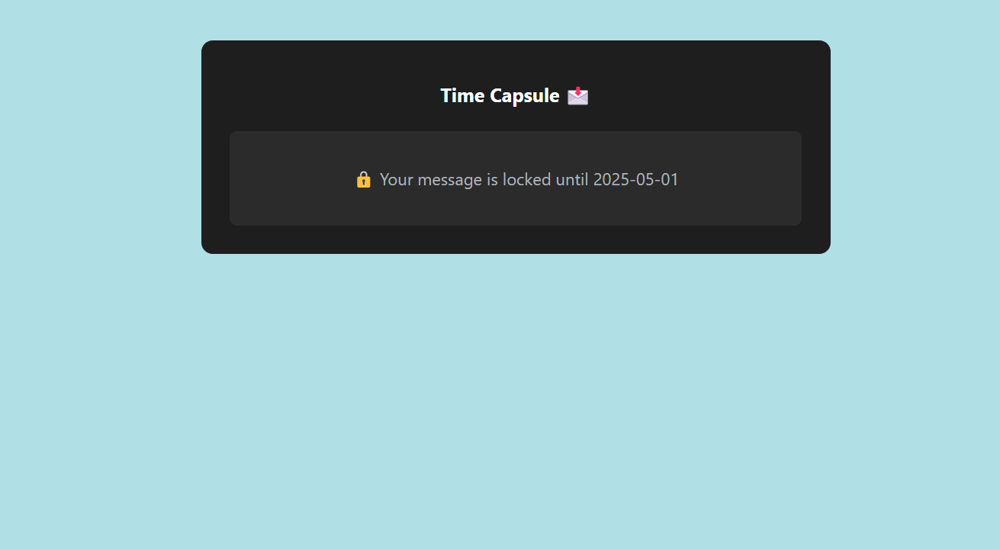

# 🕰️ Time Capsule Message

A futuristic **time-locked message vault** built in React. Users can write messages and set a future reveal date. Messages remain hidden until the chosen day arrives.

---

## 📌 Features
- 🔒 **Message Locking**: Hide messages until a future date.
- 📝 **Text Input + Date Picker**.
- ⏰ **Auto Reveal** once the date is reached.
- 💾 **Local Storage**: Messages persist across sessions.
- 🎨 **Dark/Light Mode Styling** options.

---

## 🛠️ Technologies Used
- ⚛️ **React**
- 📅 **Date Handling**
- 🎨 **CSS** (`Time.css` for styling)


---

## 🚀 Live Demo
To see it in action, clone the repository and follow the setup instructions below.

1. **Clone the repository:**

   ```bash
   git clone https://github.com/Eshhaa11/time-capsule-message-website

2. **Navigate to the project directory:**

   cd time-capsule-message-website

3. **Install dependencies:**

   npm install

4. **Start the development server:**

   npm start

5. **Open your browser and visit:**

   http://localhost:3000

---

 ## 🎨 Screenshots:
 


 ---

 ## 🤝 Contributing:
 Want to improve this project? Fork the repository, create a feature branch, and open a pull request. All contributions are welcome! 🚀✨
 
 ---

 🎉 Happy Coding!
